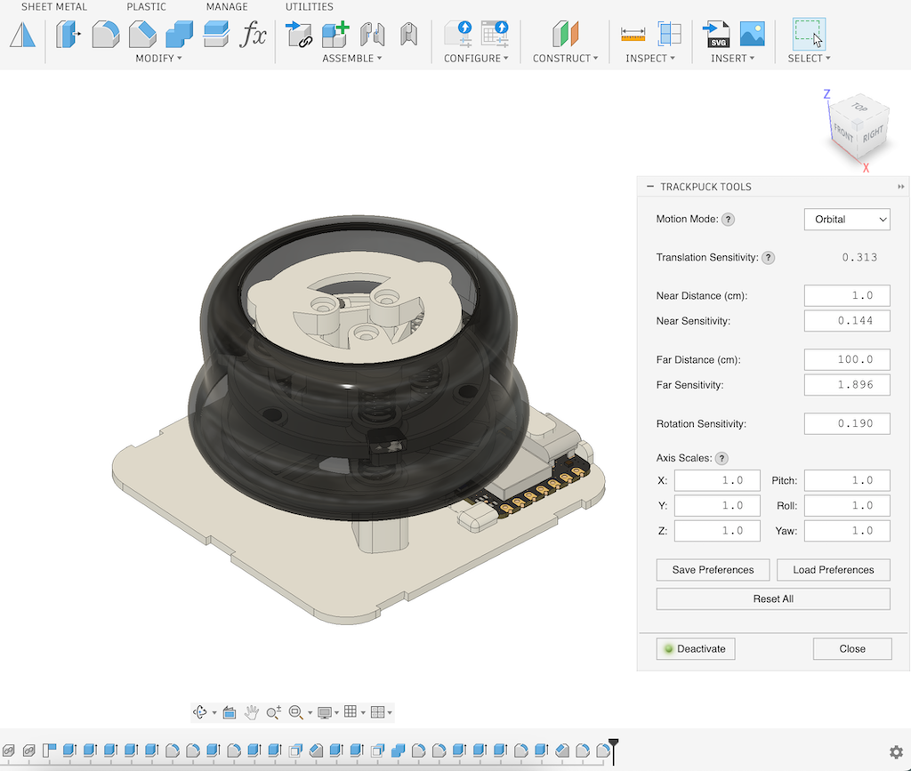

# TrackpuckTools Add-In for Fusion 360

## Overview

TrackpuckTools is a Fusion 360 add-in that connects HID-based 6DoF input peripheral devices (such as [Trackpuck](https://github.com/badjeff/trackpuck)) to Fusion 360, providing fluid control over camera orbit, pan, zoom, and rotation.

https://github.com/user-attachments/assets/f231d02b-527b-4762-a200-921404486fa5

## Supported Devices

Any HID peripheral that reports 6-axis movement (X, Y, Z translation + RX, RY, RZ rotation) via standard HID reports. The 6 axis values must be reported in the first 6 8-bit signed bytes of the HID report. Default configuration targets the Trackpuck device (ZMK VID 0x1d50, PID 0x615e) with [zmk-hid-joystick](https://github.com/badjeff/zmk-hid-joystick) module.



*Figure 1: Palettes UI & Trackpuck

## Motion Modes

- **Orbital**: Rotates camera around a fixed target point. Best for inspecting models from different angles.
- **Navigating**: Moves the camera directly through 3D space. Best for fly-through navigation.

## Dynamic Translation Sensitivity

Translation speed scales dynamically based on camera distance using linear interpolation:

```
t = (distance - NEAR_DISTANCE) / (FAR_DISTANCE - NEAR_DISTANCE)
sensitivity = NEAR_TRANS_SENSITIVITY + t × (FAR_TRANS_SENSITIVITY - NEAR_TRANS_SENSITIVITY)
```

Where:
- `distance` is the current camera distance from target
- `t` is the interpolation factor (0 = at near distance, 1 = at far distance)
- When inside the near/far range, `t` interpolates linearly between the two sensitivity values
- Below `NEAR_DISTANCE`, sensitivity stays at `NEAR_TRANS_SENSITIVITY`
- Above `FAR_DISTANCE`, sensitivity stays at `FAR_TRANS_SENSITIVITY`

This ensures smooth, predictable movement whether you're zoomed in for detailed work or zoomed out for an overview—maintaining linear, stable movement speed across varying distances.

## Installation

1. Clone this repository into a folder named `TrackpuckTools` in your Fusion 360 add-ins directory:
   - **Windows**: `%APPDATA%\Autodesk\Autodesk Fusion 360\API\AddIns\`
   - **Mac**: `~/Library/Application Support/Autodesk/Autodesk Fusion 360/API/AddIns/`

   ```bash
   cd ~/Library/Application\ Support/Autodesk/Autodesk\ Fusion\ 360/API/AddIns
   git clone https://github.com/badjeff/TrackpuckTools-Fusion360.git TrackpuckTools
   ```

2. Launch Fusion 360 and run the add-in from the **Add-Ins** panel.

3. On first run, the add-in will download and install the required `hidapi` library.

## Usage

1. Open the TrackpuckTools palette from the Add-Ins tab.
2. Click **Activate** to connect your HID device.
3. Use your 6DoF peripheral to control the view:
   - **Push/Pull**: Zoom in/out
   - **Tilt**: Orbit (pitch/yaw)
   - **Twist**: Roll
   - **Fit Button**: Press button 0 to fit view

Adjust sensitivity settings in the palette or via `config.json` to match your preferences.

## Configuration

The `config.json` file provides initial default settings. All parameters can be adjusted in real-time via the palette UI. Use the **Save Preferences** button to persist your settings, and **Load Preferences** to restore them in future sessions.

| Setting | Description | Default |
|---------|-------------|---------|
| `VENDOR_ID` | HID vendor ID (hex). Change to match your device. | `0x1d50` |
| `PRODUCT_ID` | HID product ID (hex). Change to match your device. | `0x615e` |
| `MOTION_MODE` | `1` = Orbital (moves target point), `2` = Navigating (moves camera directly). | `1` |
| `NEAR_DISTANCE` | Near distance threshold (cm). | `1.0` |
| `FAR_DISTANCE` | Far distance threshold (cm). | `100.0` |
| `NEAR_TRANS_SENSITIVITY` | Translation speed at near distance. Higher = faster movement. | `0.1` |
| `FAR_TRANS_SENSITIVITY` | Translation speed at far distance. Higher = faster movement. | `1.33` |
| `ROTATION_SENSITIVITY` | Controls orbit/rotation speed. Higher = faster rotation. | `0.123` |
| `SCALE_X`, `SCALE_Y`, `SCALE_Z` | Translation axis multipliers. Higher = faster. Negative = invert. | `1.0` |
| `SCALE_RX`, `SCALE_RY`, `SCALE_RZ` | Rotation axis multipliers. Higher = faster. Negative = invert. | `1.0` |

## Requirements

- Fusion 360 (Windows or macOS)
- HID peripheral with 6-axis input
- Internet connection (for first-time library installation)

## License

MIT License
